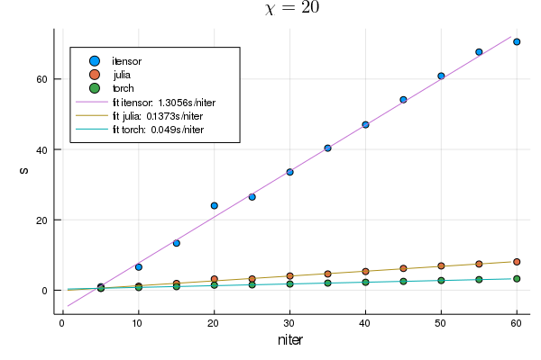
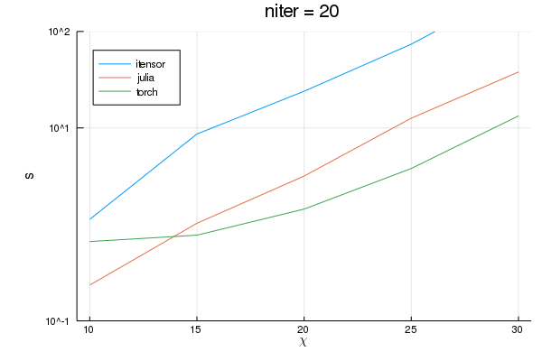

# Benchmark of Different Tenosr Implements

Currently, this test focus on three different implements: using pytorch; using julia and using itensor.

The scaling curve with iterations is



The scaling curve with maximum cuts is



both averaged over at least 5 runs and the data is available in `times.csv`.

Note that for julia, compilation time is not included (same as for itensor).

## Details

This test is done on a Thinkpad x260 with Intel(R) Core(TM) i7-6500U CPU @ 2.50GHz
and 16G of memory without a GPU.

Library versions:

| name    | version |
| ------- | --------|
| pytorch | 1.1.0   |
| julia   | 1.1.0   |
| itensor | 2.1.1   |

To perform this test on your machine, run

```bash
julia ./evaluate.jl
```

## About TRG Algorithm

[A beautiful tutorial of TRG by itensor](http://itensor.org/docs.cgi?page=book/trg)
